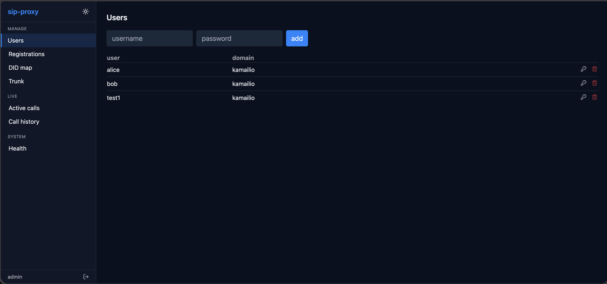

# sip-proxy

[](https://github.com/dev0miky/SIP-Proxy/actions/workflows/ci.yml)
[](./LICENSE)

A small SIP proxy / SBC example. Kamailio in front, Asterisk behind, Homer for tracing. Everything runs with `docker compose up`.

## Screenshots


*Admin panel — users tab*

## What it does

- Internal SIP clients register to Kamailio with simple demo credentials.
- Kamailio routes calls. User-to-user calls are resolved via the usrloc registrar (no media anchoring). Numeric (PSTN-shaped) numbers and the `9196` echo get handed to Asterisk.
- Asterisk holds the upstream ITSP credentials and bridges outbound calls through its `trunk` pjsip endpoint.
- DID-to-user mapping for inbound calls lives in a small Lua table (`kamailio/did_map.lua`).
- Every SIP message from Kamailio and Asterisk is mirrored to Homer over HEP. Open `http://localhost:9080` to see ladder diagrams of every call.

## Run it

**Local dev** — softphones on the same machine or LAN:

```bash
cp .env.example .env
# edit .env if you want a real ITSP trunk
make up
make wait
```

Point a softphone (Zoiper, Linphone, MicroSIP) at `localhost:5060`. Register as `alice` or `bob`, password `1234`. Dial `9196` for the echo test. Open Homer at http://localhost:9080.

**Production on a VPS** — softphones over the public internet:

See [`docs/deploy.md`](./docs/deploy.md) for the full walkthrough (DNS, firewall, Caddy with auto-TLS for the panel, fail2ban, pike rate limiting, NAT-aware Asterisk).

Short version:

```bash
cp .env.prod.example .env
# edit .env with your VPS public IP, panel hostname, ITSP creds
make panel-setup        # interactive admin password (12+ chars)
make prod-up            # COMPOSE_PROFILES=prod, brings up caddy + fail2ban too
```

## Web admin panel

For a web UI (users, DID map, trunk creds, live calls, health), see [`panel/`](./panel/):

```bash
make panel-setup    # one-time: set admin password
make up             # brings up the panel along with the rest of the stack
```

Open http://localhost:8080 (or set `PANEL_HTTP_PORT` in `.env`).

## Smoke test

```bash
make smoke
```

Health-checks every container, verifies the schema is seeded, and confirms Asterisk pjsip transports are up + Homer is responding.

## Layout

```
sip-proxy/
├── docker-compose.yml         orchestration
├── Makefile                   up / down / wait / smoke / logs / clean / nuke
├── .env.example               ITSP_* placeholders
├── kamailio/
│   ├── Dockerfile
│   ├── kamailio.cfg           thin bootstrap, loads modules, hands off to Lua
│   ├── kamailio.lua           routing logic (KEMI)
│   ├── users.lua              auth helper
│   ├── did_map.lua            DID -> internal user
│   └── entrypoint.sh
├── asterisk/
│   ├── Dockerfile             andrius/asterisk:18-current + our config
│   ├── entrypoint.sh          renders pjsip.conf.tmpl from .env at boot
│   ├── conf/pjsip.conf.tmpl   transports + kamailio endpoint + trunk endpoint
│   └── conf/extensions.conf   9196 echo + outbound-to-trunk dialplan
├── mysql/init/                Kamailio schema + demo users (alice/bob, both pwd 1234)
├── homer/                     postgres init + heplify config
├── panel/                     React + FastAPI admin panel
└── test/
    ├── wait.sh                polls each service for readiness
    └── smoke.sh               end-to-end health smoke
```

## Security

For dev (`make up`), demo passwords are `1234` and the panel binds to `localhost:8080`. Don't expose this to the internet.

For prod (`make prod-up`), the repo ships with:

- Kamailio `pike` module — drops bursts above 16 req/2s per source IP
- `fail2ban` container — bans IPs after 5 auth failures in 10 min for 1 hour
- Caddy with auto-TLS for the panel — Let's Encrypt cert, HTTPS-only
- `panel-setup` enforces ≥12-char admin password, stored as bcrypt in a docker secret file
- NAT-aware Asterisk via `EXTERNAL_IP`
- Open firewall ports limited to 80, 443, 5060, 10000–10100

Still **not** in v1, see "future work" in `docs/design.md`:

- TLS for SIP itself (port 5061)
- SRTP for media
- Audit log of admin actions
- Allowlist proxy in front of the docker socket

## How the credential hiding works

Internal SIP clients authenticate against Kamailio's `subscriber` table (their creds live only in MariaDB). When they dial a PSTN number, Kamailio routes the INVITE to Asterisk; Asterisk's `trunk` pjsip endpoint authenticates upstream using the credentials that live only in `.env`. The upstream provider never sees the internal user's identity, and internal users never see the trunk credentials.

For inbound, the upstream sends a call addressed to the trunk identity. Kamailio whitelists the upstream's IP, looks up the dialed DID in `did_map.lua`, resolves the matching internal user via the registrar, and forwards the INVITE to their registered contact.

## Tracing

Both Kamailio (via `siptrace` module) and Asterisk (via `res_hep`) ship every SIP message to `heplify-server` over HEP v3. heplify writes to PostgreSQL and Homer renders them in the web UI at http://localhost:9080. Default Homer login: `admin / sipcapture`.

## Stack

| Piece | Purpose |
|---|---|
| Kamailio 5.8 (KEMI Lua) | SIP proxy / SBC + registrar |
| Asterisk 18 (pjsip) | Media + echo + outbound trunk |
| MariaDB 11 | Kamailio `subscriber` + `location` tables |
| heplify-server | HEP capture collector |
| PostgreSQL 15 | Homer storage |
| Homer 7 web | Capture UI |

## License

MIT. See `LICENSE`.
